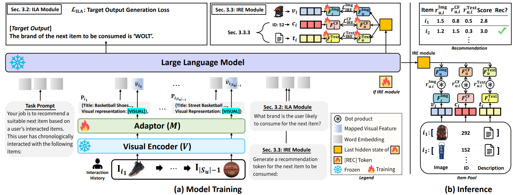

# Token-Efficient Item Representation via Images for LLM Recommender Systems 


The official source code for [Token-Efficient Item Representation via Images for LLM Recommender Systems ](https://openreview.net/forum?id=vizM7B7vuW), accepted at [ICLR 2026](https://iclr.cc/).

## Overview
<!---->


We propose the **I-LLMRec**, an effective and efficient LLM-based recommender systems, which leverages item images to capture user preferences instead of lengthy item descrptions. However, since the image and language space are not aligned, we propose **ILA** module to effectively bridge the gap between two spaces. Furthermore, we propose **IRE** module to reformulate the recommendation to a retrieval task for reliable and effiecent recommendation.

##  **Install**    

```python  
conda create -n i_llmrec python=3.10 -y  
conda activate i_llmrec  
pip install torch==2.0.1 torchvision==0.15.2 # CUDA: 11.7
pip install numpy==1.26.4 transformers==4.36.2 sentence_transformers==3.0.1 deepspeed==0.9.5 accelerate==0.27.2
pip install flash-attn==2.4.2 # CUDA version should upper than 11.7
pip install git+https://github.com/bfshi/scaling_on_scales.git
pip install sentencepiece==0.1.99
pip install protobuf==3.20.*
pip install tqdm gdown
``` 

Or, run bash file.  

``` bash  
bash environment.sh
```  

##  **Data & Feature Preprocess**    

You can download all the files, including *pre-processed datasets* and *featuers*, from the Google Drive.  

``` bash  
bash dataset/download_google_drive.sh {DATA_NAME} # Art, Sport, Grocery, Phone
```  

Or, you can follow the below shell file to download the datasets and preprocess the features.

### Data Download  

Please download the Amazon recommendation datasets by running the below bash file.
``` bash  
bash dataset/preprocess.sh {DATA_NAME} # Art, Sport, Grocery, Phone  
```  

### Feature Preprocess  
After downloading the dataset, extract the visual, ID (CF), and textual features.  
``` bash  
CUDA_VISIBLE_DEVICES={GPU_ID} bash feature_preprocess/preprocess.sh {DATA_NAME} # Art, Sport, Grocery, Phone
```   


##  Train  

To leverage LLaMA 2.7B, you need to get the huggingface token id from [LLaMA Homepage](https://huggingface.co/meta-llama/Llama-2-7b-hf).
Then, insert the token id to `HUGGINGFACE_TOKEN_ID`

``` bash  
CUDA_VISIBLE_DEVICES={GPU_ID} bash train.sh {DATA_NAME} {GPU_NUM} {HUGGINGFACE_TOKEN_ID}
# e.g., CUDA_VISIBLE_DEVICES=0,1 bash train.sh Art 2 {HUGGINGFACE_TOKEN_ID}
```   

## Test  
Please change the variable `MODEL_OUTPUT_PATH` to the real model output path.

``` bash  
CUDA_VISIBLE_DEVICES=0 bash test.sh {MODEL_OUTPUT_PATH}
```


## Acknowledgement  
* [VILA](http://github.com/NVlabs/VILA/tree/main/llava/model/language_model), [LLaVA](https://github.com/haotian-liu/LLaVA): this code is build upon these codes.
* [SASRec](https://github.com/pmixer/SASRec.pytorch): To extract CF feature, this code is utilized.